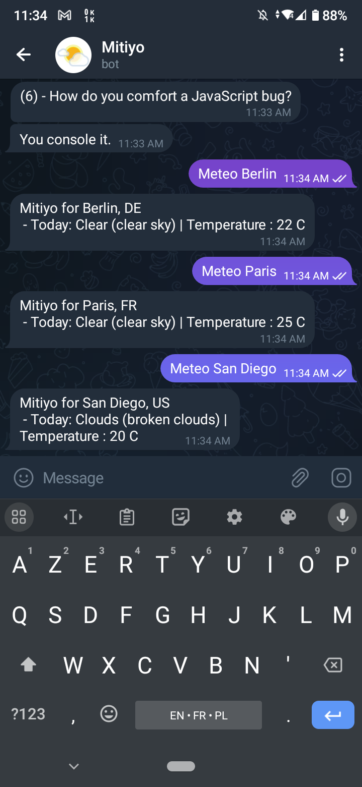

# Mitiyo - Telegram Weather Chatbot
This Telegram chatbot uses [OpenWeather's API](https://openweathermap.org/api) to return the current forecast of a specific city. Coded in Java. Not currently hosted.

